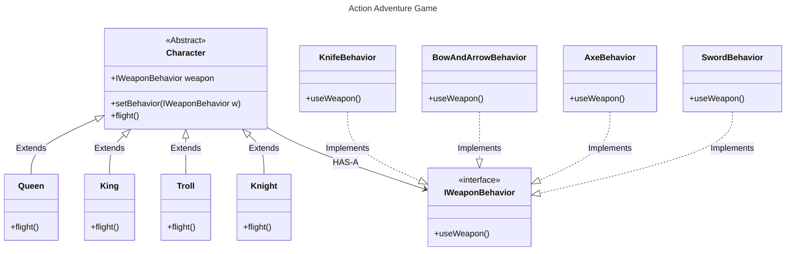

# Strategy Pattern

### This is an example of using the strategy pattern based on the exercises from "Head First Design Pattern".

The Fight function is defined in the Character class and each character type implements its own fighting behavior. The Character class has a behavior that the user can utilize with the selected character's strategy.

The following figure displays the class diagram of the implemented solution:

***

The next definition was taken from the book: 

"The **Strategy Pattern** defines a family of algorithms, encapsulates each one, and makes them interchangeable. Strategy lets the algorithm vary independently from clients that use it."

